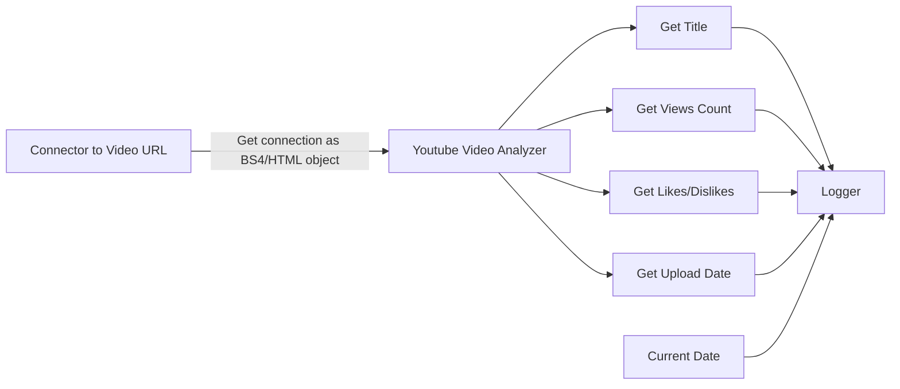

### API  to connect and retrieve data from Youtube

```mermaid
graph   LR
    A[Connector to Video URL] -->|Get connection as BS4/HTML object| B[Youtube Video Analyzer]
    B --> D[Get Title]
    B --> F[Get Views Count]
    B --> E[Get Likes/Dislikes]
    B --> G[Get Upload Date]
    D --> I[Logger]
    F --> I[Logger]
    E --> I[Logger]
    G --> I[Logger]
    J[Current Date] --> I[Logger]
```